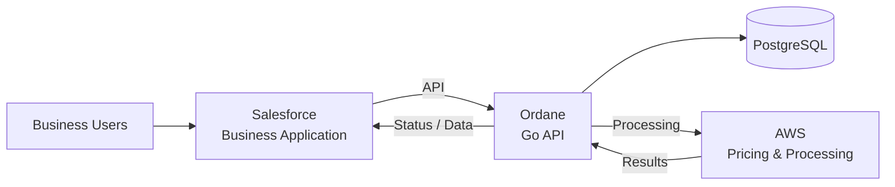
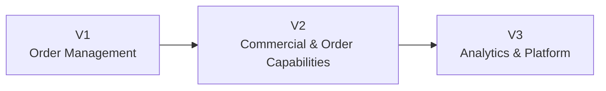

# Ordane

Ordane is a portfolio project: a B2B order-management platform built as an evolving system rather than a single deliverable, moving from a standalone backend to an integrated, cloud-deployed platform.

## Systems

- **Business Application** — Salesforce (Apex, LWC, automation) — customer-facing front end for order submission and tracking
- **Backend Platform** — Go, Gin, PostgreSQL — owns the order domain and acts as the system of record
- **Mobile Application** — iOS (Swift) — native client consuming the backend API

## Project Stages

1. **Order Management Core** — Domain model: customers, products, orders, order lifecycle
2. **Backend Platform** — Go API, business rules, PostgreSQL persistence
3. **Business Application** — Salesforce customer and order management
4. **System Integration** — Salesforce ↔ API integration
5. **Cloud Deployment** — AWS, containers, CI/CD, monitoring
6. **Asynchronous Processing** — Events, queues, workers, retries
7. **Mobile Application** — Native iOS client
8. **Analytics Platform** — Reporting and analytical workloads

## Repository

- `docs/architecture/` — Architecture decisions, diagrams, domain documentation
- `evolution/` — Project evolution and milestones
- `proposals/` — Proposed features and architectural changes